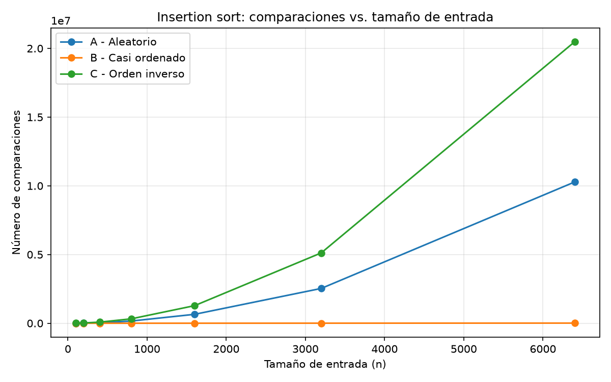
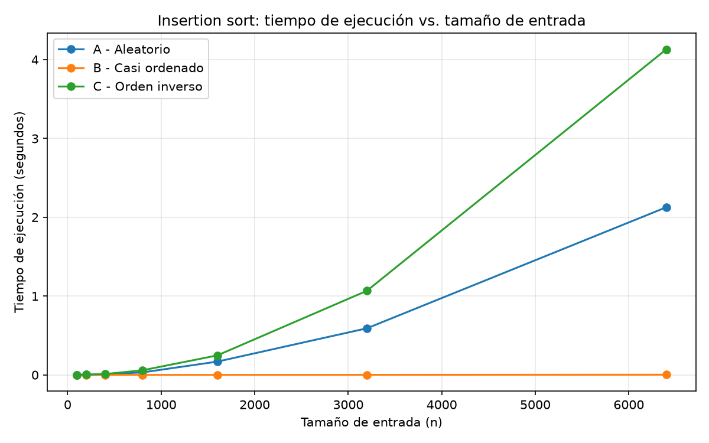
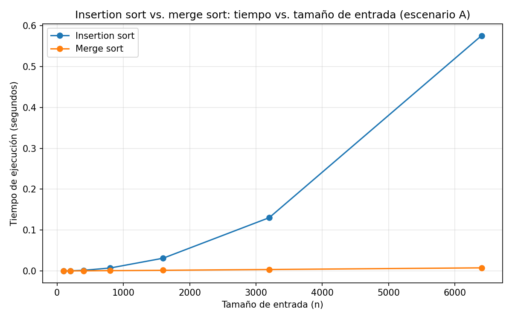

# Laboratorio 1: Fundamentos, complejidad y recurrencias

- **Nombre completo:** JUAN FELIPE PATIÑO CALDERON
- **Documento:** 1.000.894.816
- **Docente:** SANTIAGO SUAREZ CORTES
- **Asignatura:** Análisis de Algoritmos (Asincronico)

## Parte 1

 Se debe pensar antes de firmar la compra del servidor en que hay que separar dos preguntas que el argumento de infraestructura mezcla en el mismo problema: si insertion sort produce el resultado correcto y si lo produce dentro del tiempo  en que el sistema tiene disponible para producirlo. Que el algoritmo lleve ocho años entregando la lista bien ordenada solo confirma lo que la **corrección**, es decir, que para cualquier entrada válida el algoritmo termina y devuelve los 1.200.000 registros efectivamente ordenados por índice de riesgo. Eso nunca estuvo en duda y que duplicar el servidor no lo mejora ni lo empeora en si dado que Lo que está en duda es la **eficiencia** y aquí la pregunta no es abstracta dado que la restricción concreta que Tamiza incumple es una ventana de tiempo de cuatro horas de 2pm a 6 pm para ordenar el lote completo antes de que el centro de contacto abra. Un algoritmo puede ser perfectamente correcto y, aun así, no caber en esa restricción de tiempo y eso es exactamente lo que empezó a pasar cuando el volumen de datos creció de 20.000 a 1.200.000 registros. La razón de fondo es que insertion sort no escala linealmente con el tamaño de la entrada, dado mis propias mediciones  de la Parte 3 muestran que su número de comparaciones crece de forma cuadrática.

 Un ejemplo de mi propio trabajo como ingeniero de datos en el sector financiero es en un proceso de conciliación nocturna de transacciones, el sistema recibe cada noche un lote de movimientos del día que debe conciliarse contra los registros bancarios antes de que abra la operación al día siguiente, dentro de una ventana de procesamiento de un par de horas. Si esa conciliación usara un algoritmo con crecimiento cuadrático sobre el volumen de transacciones, en algún punto del crecimiento del negocio (más clientes, más transacciones diarias) el proceso simplemente dejaría de caber en la ventana nocturna, sin que el resultado dejara de ser correcto  el mismo patrón que Tamiza.

 ## Parte 2

 Dado que la dimensión ambiental de esta decisión no resulta muy evidente a primera vista  dado que puesto que un servidor no contamina de forma visible, hay que considerar que el tiempo de ejecución de un proceso es literalmente un tiempo en el que la máquina consume energía en plena carga. Dado que cada segundo extra que el ordenamiento tarda se convierte en calor disipado y no en trabajo útil, el problema no radica en el consumo de una sola corrida, sino en el hecho de que este proceso corre todas las madrugadas, los 365 días del año, desde hace ocho años. Ya que ese consumo energético se multiplica por miles de ejecuciones acumuladas, y que crecerá a medida que el programa de tamizaje se amplíe y para elegir un algoritmo con mejor complejidad es una decisión que reduce de forma permanente la huella energética en el proceso.

Por otro lado dado el análisis en la dimensión ética, es posible identificar dos perjuicios concretos:

* **El paciente:** Dado si el proceso no termina a tiempo el centro de contacto abre con una lista incompleta, una persona con alto riesgo cardiovascular puede quedar sin contactar o ser llamada después de alguien de menor riesgo; un costo que asume el paciente y no la institución.
* **El operador del centro de contacto:** Dado que debe trabajar con información incompleta y bajo presión sin saber que el fallo es técnico el segundo perjuicio recae sobre el que probablemente reciba reclamos por causas ajenas a su labor diaria.

El orden de la lista decide a quién se llama primero y la obligación del algoritmo no es entregar el resultado eventualmente, sino hacerlo correctamente **en cada ejecución** y que un algoritmo rápido pero propenso a errores en casos límite es más peligroso que uno lento pero confiable dado que el error se traduce en una decisión clínica incorrecta no auditada o controlada, esto radica a la obligación de verificar no solo la velocidad, sino la **corrección** mediante pruebas y que no basta con confiar en que se diga que siempre ha funcionado.

## Parte 3

Código: [`algoritmos.py`](./algoritmos.py) · [`datos.py`](./datos.py) · [`parte3_casos.py`](./parte3_casos.py)

### 3.1

Dado que los tres casos de análisis se definen sobre el mismo conjunto, es decir sobre todas las entradas posibles de un tamaño fijo, hay que entender que el peor caso es simplemente el máximo de operaciones que el algoritmo puede hacer sobre cualquier entrada de tamaño. Esto nos da una garantía de de que la cota superior, sin importar qué tan probable sea que llegue esa entrada. Dado, el mejor caso es el mínimo sobre ese mismo conjunto, mientras que el caso promedio es basicamente el valor esperado bajo una probabilidad que se asume sobre las entradas de tamaño. Así los tres se comparan siempre a tamaño fijo ya que el punto es ver cómo se comporta el algoritmo en función de no comparar tamaños distintos entre si.

Ahora para decidir si el algoritmo de Tamiza va a producción o no yo usaría el peor caso y no el promedio, dado que la ventana de cuatro horas es un *punto muerto* o restricción y no nos sirve que el proceso termine a tiempo "en promedio" y falle una que otra noche, dado que cada caída deja a pacientes de alto riesgo en el aire y el taller ya dice que esta vuelta ha pasado tres veces. Ya que diseñar contra el caso promedio es basicamente programar para que el sistema falle cada cierto tiempo, guiarse por el peor caso es la única forma de asegurar que el proceso siempre entre en la ventana correcta garantizando la no falla sin importar cómo llegue el lote esa noche ya que puede venir de diferentes maneras.

**Mi predicción antes de tirar código o medir:**
* **Escenario C (orden inverso):** Dado que estamos ordenando de mayor a menor y cada elemento nuevo es menor que los que ya están procesados, le toca recorrer y comparar contra toda la lista ordenada hasta el final. Así mismo, este sería el peor caso de *insertion sort*.
* **Escenario B (casi ordenado):** Debería ser el mejor caso, dado que el 98% de la lista ya viene en el orden correcto y la mayoría de las inserciones no tienen que desplazar nada.
* **Escenario A (aleatorio):** Dado que los datos vienen revueltos sin un patrón fijo, debería quedar ahí en el medio, tirando más hacia el caso promedio.

### 3.2

**Convención de orden:** Tamiza ordena los índices de riesgo de **mayor a menor**. Los tres generadores y ambos algoritmos de este laboratorio siguen esa convención.

**Datos medidos** número de comparaciones de `insertion_sort` por escenario y tamaño:

| n | A - Aleatorio | B - Casi ordenado | C - Orden inverso |
|---|---|---|---|
| 100 | 2 542 | 99 | 4 950 |
| 200 | 9 970 | 201 | 19 900 |
| 400 | 40 436 | 409 | 79 800 |
| 800 | 160 484 | 852 | 319 600 |
| 1600 | 648 481 | 1 843 | 1 279 200 |
| 3200 | 2 533 103 | 4 242 | 5 118 400 |
| 6400 | 10 276 753 | 10 649 | 20 476 800 |

Los datos confirman la predicción. En n = 6.400, el escenario C requirió 20.476.800 comparaciones, el escenario A 10.276.753, y el escenario B apenas 10.649 que es casi tres órdenes de magnitud menos que los otros dos. La forma de las curvas en `parte3_comparaciones.png` es igual de diciente: C y A crecen, mientras que B se mantiene prácticamente pegado al eje horizontal en toda la gráfica, con un crecimiento que se ve lineal.
con estoS resultados, **C es el peor caso, B es el mejor caso, y A se aproxima al caso promedio** igual que la predicción de 3.1. 

## Parte 4 

### 4.1 

**Recurrencia de merge sort.** Merge sort divide cada llamada en dos subproblemas a = 2 de la mitad del tamaño original b = 2, porque cada subproblema tiene tamaño n/2 y el costo de combinar dos mitades ya ordenadas mediante `_mezclar` es lineal en el tamaño total de la lista porque la mezcla recorre cada elemento de las dos sublistas exactamente una vez: f(n) = Θ(n). Eso da la recurrencia:

T(n) = 2T(n/2) + Θ(n)

**Solucón por método maestro.** Con a = 2, b = 2 y f(n) = Θ(n), calculo n^(log_b a) = n^(log₂ 2) = n¹ = n. Comparo f(n) contra esa cota: f(n) = Θ(n) = Θ(n^(log_b a)), así que estamos exactamente en el **caso 2** del método maestro, que concluye:

T(n) = Θ(n^(log_b a) · log n) = Θ(n log n)

**Cálculo de insertion sort línea a línea.** Analizo mi implementación en `algoritmos.py`. El ciclo externo `for i in range(1, len(lista))` se ejecuta n − 1 veces. Dentro de él, la asignación de `clave` y de `j` es de costo constante en cada iteración. El ciclo interno `while j >= 0 and lista[j] < clave` es el que determina el costo total: en la iteración i, se ejecuta como máximo i veces (cuando el elemento debe desplazarse hasta el inicio) y como mínimo 0 veces. Sumando sobre las n−1 iteraciones del ciclo externo:

- **Mejor caso:** el `while` nunca entra a su cuerpo  con 0 desplazamientos por iteración así que el costo total es Θ(n)  solo la comparación de salida del `while` y las asignaciones de costo constante en cada una de las n−1 iteraciones del ciclo externo.
- **Peor caso:** el `while` se ejecuta i veces en la iteración i, así que el total de comparaciones es 1 + 2 + ... + (n−1) = n(n−1)/2 = Θ(n²).
- **Caso promedio:** en promedio, cada elemento nuevo se desplaza aproximadamente la mitad de las posiciones que en el peor caso así que el número esperado de comparaciones es del orden de n²/4 = Θ(n²)  mismo orden de crecimiento que el peor caso, con una constante menor.

**Tabla de complejidades:**

| Algoritmo | Mejor caso | Peor caso | Caso promedio |
|---|---|---|---|
| Insertion sort | Θ(n) | Θ(n²) | Θ(n²) |
| Merge sort | Θ(n log n) | Θ(n log n) | Θ(n log n) |

### 4.2

Código: [código de la Parte 4](./parte4_complejidad.py)

**Datos medidos** (tiempo promedio en segundos, escenario A):

| n | Insertion sort | Merge sort |
|---|---|---|
| 100 | 0.000093 | 0.000088 |
| 200 | 0.000395 | 0.000149 |
| 400 | 0.001650 | 0.000374 |
| 800 | 0.007230 | 0.000782 |
| 1600 | 0.031213 | 0.001673 |
| 3200 | 0.130357 | 0.003591 |
| 6400 | 0.575349 | 0.007628 |

La grafica muestra dos comportamientos claramente distintos dado que la curva de insertion sort es plana para tamaños pequeños y luego se dispara entre n igual a 1600 y n igual a 3200 al duplicar el tamaño el tiempo pasa de 0.031213 segundos a 0.130357 segundos un factor de aproximadamente 418 veces entre 3200 y 6400 pasa a 0.575349 segundos un factor de aproximadamente 441 veces ese factor cercano a 4 cada vez que n se duplica es exactamente la firma de un crecimiento O de n al cuadrado ya que 2 al cuadrado es igual a 4 por otro lado la curva de merge sort crece mucho mas suavemente entre 1600 y 3200 el tiempo pasa de 0.001673 segundos a 0.003591 segundos factor aproximadamente 215 veces y entre 3200 y 6400 a 0.007628 segundos factor aproximadamente 212 veces un factor apenas superior a 2 consistente con un crecimiento O de n log n donde duplicar n multiplica el tiempo por 2 mas un pequeño incremento del factor logaritmico

Esto coincide exactamente con lo calculado anteriormente dado que insertion sort es Theta de n al cuadrado y merge sort es Theta de n log n y las razones de crecimiento medidas aproximadamente 4 veces versus 2 veces son la evidencia empirica de esa diferencia asintotica para Tamiza esto significa que merge sort es la opcion que escala de forma sostenible a medida que el programa siga creciendo mientras que insertion sort empeora cada vez mas rapido

En n igual a 100 los tiempos estan casi empatados 0000093 segundos versus 0000088 segundos a pesar de que merge sort es asintoticamente mejor esto se explica porque a tamaños tan pequeños las constantes ocultas detras de la notacion O pesan mas que el orden de crecimiento dado que merge sort paga el costo de hacer llamadas recursivas y de construir listas nuevas en cada nivel de la mezcla mientras que insertion sort simplemente recorre e inserta en el mismo espacio de memoria

### 4.3

Dado que nos piden una recomendacion clara, yo sugiero que Tamiza tire de una vez por merge sort en produccion y deje de lado insertion sort. Ya que el criterio clave aqui no es solo la velocidad promedio, sino la robustez frente al canal de entrada, hay que tener en cuenta que el canal de origen puede cambiar de la nada entre los tres escenarios. Dado que el equipo no quiere ponerse a mantener tres implementaciones distintas, esto descarta la idea de usar insertion sort solo cuando venga del reproceso, dado que eso exigiria saber de antemano que canal va a entrar y el taller deja claro que esa parte no esta garantizada. Asimismo, ya que merge sort es Theta de n log n en los tres casos, este algoritmo nos asegura una garantia pareja sin importar que escenario caiga. Por el contrario, insertion sort vuela en el escenario B Theta de n, pero resulta ser malo en el escenario C Theta de n al cuadrado, asi que meterle a insertion sort es basicamente apostar a que el canal nunca va a cambiar a un caso desfavorable.

Para insertion sort Theta de n al cuadrado: Dado que el tiempo escala por k al cuadrado aproximadamente 35156, esto nos daria 0,575349 segundos por 35156, que da aproximadamente 20227 segundos unas 5,6 horas. O sea, queda por encima del limite de 4 horas lo cual encaja con el hecho de que el sistema ya viene fallando en produccion.

Para merge sort Theta de n log n Ya que el tiempo escala por k multiplicado por la razon de los logaritmos log2 de 1200000 sobre log2 de 6400, que es aproximadamente 20,2 sobre 12,6, dando 1,6, el factor queda como en aproximadamente 300. Esto nos da 0,007628 segundos por 300, que da aproximadamente 2,3 segundos, quedando super ajustado con un margen de mas de 6000 veces.

Respecto a la propuesta de duplicar la velocidad del servidor dado que un servidor del doble de potente a lo mucho divide el tiempo entre 2, si se lo aplicamos a la estimacion de insertion sort aproximadamente 20227 segundos, apenas bajaria a unos 10114 segundos aproximadamente 2,8 horas. Esto tecnicamente daria para entrar en la ventana hoy, pero solo por hoy. Dado que el crecimiento de insertion sort es cuadratico, la proxima vez que suba el volumen de datos el tiempo se va a disparar mal y tocaria meterle mas plata a la infraestructura. En cambio, migrar a merge sort deja un margen enorme frente al tiempo disponible, absorbiendo años de crecimiento sin tener que tocar la maquina.

Por ultimo mas alla de los tiempos, hay un detalle con la RAM que toca dejar claro: dado que mi codigo de merge sort va armando listas nuevas en cada nivel de la mezcla, consume memoria extra proporcional al tamaño del lote, a diferencia de insertion sort que ordena sobre la misma lista. Ya que para 1200000 enteros esa RAM extra la aguanta cualquier servidor normal, igual es un costo real que antes no estaba y vale la pena tener en el radar antes de desplegar esto a produccion.