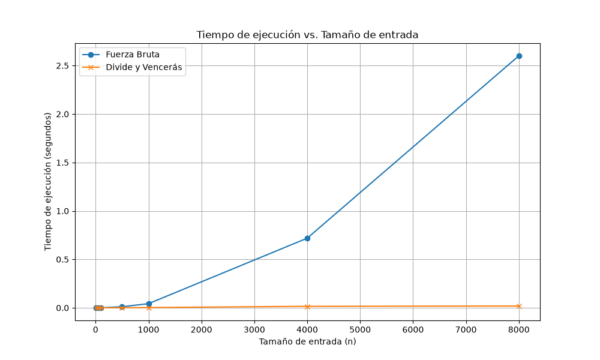

# Laboratorio 2: Divide y Vencerás - Subarreglo Máximo

- **Nombre completo:** JUAN FELIPE PATIÑO CALDERON
- **Documento:** CC 1.000.894.816
- **Docente:** SANTIAGO SUAREZ CORTES
- **Asignatura:** Análisis de Algoritmos (Asincronico)

## Instrucciones para reproducir
1. Abra una terminal en la raíz del repositorio y active el entorno virtual:
   - Windows: `.\venv\Scripts\activate`
   - Linux/Mac: `source venv/bin/activate`
2. Instale las dependencias si no lo ha hecho:
   `pip install -r requirements.txt`
3. Para ejecutar las pruebas de correctitud:
   `python laboratorios/lab2-divide-y-vencer/pruebas.py`
4. Para ejecutar el experimento de medición de tiempos y generar la gráfica:
   `python laboratorios/lab2-divide-y-vencer/medicion.py`

---

## Parte 1 — Verificación de las soluciones

Enlace al código de los algoritmos: [subarreglo.py](subarreglo.py)  
Enlace al código de pruebas: [pruebas.py](pruebas.py)

Para verificar que las soluciones son correctas, se implementó un script de pruebas con los siguientes casos:
1. La serie de 8 días planteada en el problema, verificando que devuelva la suma correcta de 17.
2. Un arreglo con un único elemento (verifica el caso base).
3. Un arreglo con solo números negativos, que debe devolver el elemento menos negativo.
4. Un arreglo con solo números positivos, que debe devolver la suma total.
5. Un arreglo diseñado a mano donde la suma máxima necesariamente cruza el punto medio, asegurando la correctitud de `suma_cruzada`.
6. Un conjunto de 20 listas aleatorias de tamaños variados, comparando que el algoritmo de fuerza bruta y el de divide y vencerás devuelvan el mismo resultado de forma consistente.

---

## Parte 2 — Medición y gráficas

Enlace al código de medición: [medicion.py](medicion.py)

A continuación, la gráfica de resultados del experimento:

**Nota sobre la medición:**
Los datos se generaron utilizando la semilla 42 de `random` para asegurar la reproducibilidad. Se cronometró únicamente la llamada a las funciones empleando `time.perf_counter()`, excluyendo el tiempo de generación de los datos. A continuación se presentan los tiempos medidos en segundos:

| Tamaño (n) | Fuerza Bruta (s) | Divide y Vencerás (s) |
|------------|------------------|-----------------------|
| 10 | 0.000015 | 0.000027 |
| 50 | 0.000163 | 0.000119 |
| 100 | 0.000276 | 0.000154 |
| 500 | 0.014240 | 0.001296 |
| 1000 | 0.046114 | 0.001923 |
| 4000 | 0.665777 | 0.011125 |
| 8000 | 2.723692 | 0.022753 |

---

## Parte 3 — Análisis

**1. Recurrencia y Fuerza Bruta**
Para el `subarreglo_maximo` la recurrencia que me dio es $T(n) = 2T(n/2) + \Theta(n)$. 
Básicamente sale de que partimos el arreglo a la mitad, o sea **dos** subproblemas de tamaño $n/2$. Luego el caso cruzado lo que hace es recorrer desde el centro a los lados, y eso nos cuesta $\Theta(n)$.
Para resolverla usé el método maestro: acá $a=2$, $b=2$, y $f(n) = \Theta(n)$. Como $n^{\log_b a} = n^1$, caemos en el **Caso 2** del teorema. Así que $T(n) = \Theta(n \log n)$.
Por el otro lado, la fuerza bruta es $\Theta(n^2)$ más que nada porque tiene dos ciclos `for` anidados. Uno para el inicio y otro para el fin del subarreglo, entonces evalúa casi $\frac{n^2}{2}$ combinaciones posibles.

**2. Lo medido contra lo esperado**
Mirando la gráfica, a medida que $n$ crece la fuerza bruta se dispara como una parábola, mientras que divide y vencerás casi que ni se despega del eje horizontal.
Si tomamos el salto de 4000 a 8000 (o sea, duplicando $n$):
- El tiempo de fuerza bruta saltó de $0.665$ s a $2.723$ s. Se multiplicó por $4.09$ mas o menos. Y pues esto cuadra con $\Theta(n^2)$, porque si $n$ es el doble, el tiempo debe ser $2^2 = 4$ veces mayor.
- Para divide y vencerás el tiempo pasó de $0.011$ s a $0.022$ s, multiplicándose casi por $2.0$. Lo cual tiene mucho sentido con $\Theta(n \log n)$, porque debería crecer solo un poquitico más del doble.

**3. Tamaños pequeños**
En mis pruebas, noté que divide y vencerás le empieza a ganar a la fuerza bruta más o menos desde $n = 50$ (ahí me dio $0.000119$ s contra $0.000163$ s). Pero, en un tamaño súper pequeño como $n=10$, la fuerza bruta fue más rápida ($0.000015$ s vs $0.000027$ s). Esto pasa por el "overhead" o la carga que tiene hacer tantas llamadas recursivas; en listas muy cortitas no vale la pena todo ese esfuerzo extra.

**4. ¿Cuándo conviene dividir?**
Por ejemplo si tenemos que buscar el máximo de un arreglo. Si nos ponemos a dividir a la mitad, la recurrencia nos quedaría $T(n) = 2T(n/2) + \Theta(1)$ (combinar es solo hacer una comparación entre dos números). Por método maestro eso nos da $\Theta(n)$. 
Pero hacer un for normal de toda la vida también es $\Theta(n)$. O sea que dividir no nos está aportando nada de eficiencia, solo gasta memoria en recursión. En conclusión, solo vale la pena aplicar divide y vencerás si el costo de combinar los resultados es menor a lo que nos costaría resolver todo de forma bruta.

**5. Concepto para la gerente**
Definitivamente le recomiendo a la cooperativa irse por **Divide y Vencerás**. 
*Estimación:* Si pensamos en analizar 1.000.000 de registros, tomando mis datos de $n=8000$. Para la fuerza bruta, $n$ crecería 125 veces, entonces el tiempo se va a multiplicar por $125^2 \approx 15.625$. Eso haría que el código se quede corriendo como por $11.8$ horas ($2.72 \times 15625$ segundos) por cada tienda, lo cual no es viable. 
En cambio, con divide y vencerás, el tiempo crecería unas 150 veces aprox; tomando mis $0.022$ s base, se tardaría como $3$ segundos en analizar el millón de registros. Igual vale aclarar que es solo una estimación matemática y en la vida real depende del procesador y la memoria RAM, pero la diferencia es abismal.
